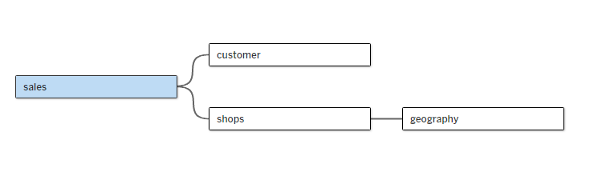
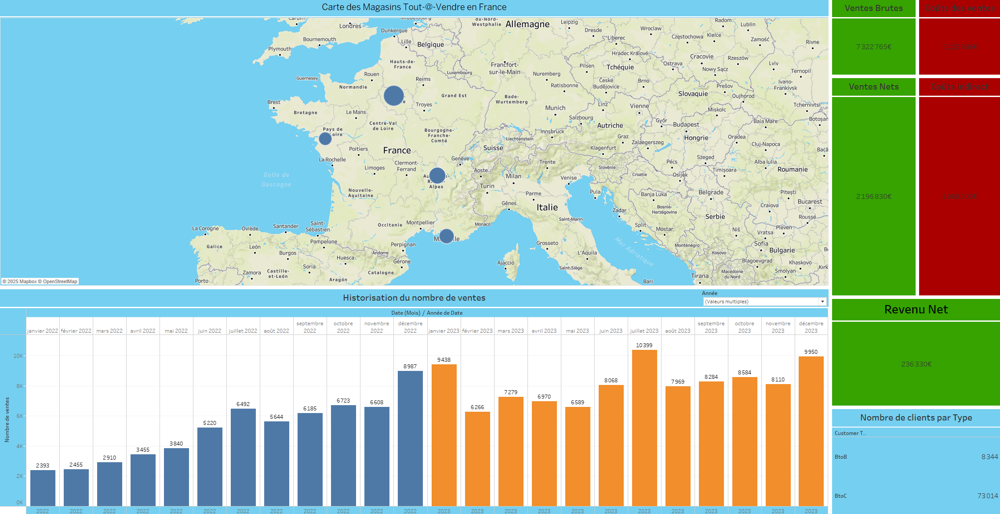

# Etude de cas d'une base de données (Test) d'un magasin "Tout-@-Vendre"

## Contexte

Le client souhaite exploiter ses données de ventes pour identifier les points forts et faibles de ses magasins, en prenant en compte la saisonnalité et la diversité des tailles des magasins.


## Objectif

L'objectif de ce projet est d'analyser les ventes brutes, la marge et les caractéristiques des magasins pour identifier les points forts et faibles, en tenant compte des effets de saisonnalité, afin d'ajuster la stratégie commerciale et optimiser les performances des différents magasins.

## Les étapes


1. **Préparation des données (Data preprocessing)**
   
Cette étape consiste à nettoyer et transformer les données de ventes fournies par le client. Elle inclut la gestion des valeurs manquantes, la normalisation des formats de données, l'identification et l'élimination des valeurs aberrantes (par exemple, les ventes anormalement élevées), ainsi que la création de nouvelles variables pour analyser la saisonnalité et la performance des magasins.

  
   ```python
     import pandas as pd

      # Charger le fichier Excel
      file_path = "DATA v2 (1).xlsx"
      xls = pd.ExcelFile(file_path)

      # Liste des feuilles à charger
      sheet_names = xls.sheet_names

      #Dictionnaire pour stocker les DataFrames nettoyées
      df_cleaned = {}

      #Charger et nettoyer les données de chaque feuille
      for sheet in sheet_names:
          df = xls.parse(sheet)
    
          #Suppression des colonnes inutiles (exemple de la feuille 'sales')
          if 'Unnamed: 0' in df.columns:
              df = df.drop(columns=['Unnamed: 0'], errors='ignore')

          #Exemple pour détecter et supprimer des valeurs aberrantes pour la colonne 'Ventes bruts'
          if 'Ventes bruts' in df.columns:
              df = df[df['Ventes bruts'] <= 255]

          # Ajouter le DataFrame nettoyé au dictionnaire
          df_cleaned[sheet] = df
     
      #Sauvegarder les DataFrames nettoyées dans un nouveau fichier Excel
      output_file_path = "dataframe_clean.xlsx"
         with pd.ExcelWriter(output_file_path) as writer:
             for sheet, df in df_cleaned.items():
                 df.to_excel(writer, sheet_name=sheet, index=False)

      print("Structure du DataFrame nettoyé :")
      for sheet, df in df_cleaned.items():
          print(f"\nAnalyse de la feuille : {sheet}")
          print("Aperçu des premières lignes :")
          print(df.head())  # Affiche les 5 premières lignes du DataFrame
          print("\nInformation générale sur la structure :")
          print(df.info())  # Affiche les types de données, nombre de valeurs non-nulles, etc.
          print("\nValeurs manquantes par colonne :")
          print(df.isnull().sum())  # Affiche le nombre de valeurs manquantes par colonne
          print("-" * 50)
   ```


3. **Modélisation des données**
   
   Nous avons utilisé un modèle en flocon (snowflake) pour relier la table des ventes (table de faits) à des tables de dimensions telles que géographie, magasins et clients.

     - Ventes (Sales) : Table principale contenant les ventes brutes et la marge.
     - Géographie (Geography) : Informations sur la localisation des magasins (région, pays).
     - Magasins (Shops) : Détails des magasins, comme la taille et le type.
     - Clients (Customer) : Données démographiques et comportement d'achat des clients.
      
   
      Ce modèle permet non seulement une analyse détaillée et flexible des données, mais il réduit également la redondance des informations en centralisant les données liées aux dimensions (comme les clients, magasins ou géographies) dans des tables séparées. Cela optimise la gestion des données, améliore les performances des requêtes, et simplifie les mises à jour des    informations sans affecter la table des faits. En outre, ce modèle facilite l'ajout de nouvelles dimensions à l'avenir sans perturber la structure existante.
  

   


4. **Visualisation des données**


Le dashboard interactif offre plusieurs fonctionnalités permettant d'analyser et de visualiser les performances de l'entreprise de manière intuitive et dynamique :


- **Carte centrale de la France** : La carte interactive affiche l'emplacement des différents magasins de la marque à travers la France. L'utilisateur peut zoomer et naviguer sur la carte pour localiser les magasins et obtenir des informations détaillées sur leur performance.

- **KPIs à analyser** : Des indicateurs clés de performance (KPIs) sont affichés pour permettre une analyse rapide de la santé financière et opérationnelle de l'entreprise. Les KPIs incluent :
  - **Ventes brutes** : Mesure des ventes totales réalisées par chaque magasin.
  - **Coût des ventes** : Calcul des coûts associés à la production ou à la distribution des produits.
  - **Ventes nettes** : Ventes après déduction des retours et remises.
  - **Coûts indirects** : Dépenses non directement liées aux ventes mais essentielles à l'opération (marketing, gestion, etc.).
  - **Revenu net** : Revenu après déduction des coûts directs et indirects.
  - **Nombre de clients par type** : Répartition des clients en fonction de leur profil (BtoB ou BtoC)

- **Historisation du nombre de commandes par mois** : Des diagrammes en bâtons permettent de suivre l'évolution des commandes au fil du temps. Les utilisateurs peuvent filtrer par année pour analyser les tendances et observer les effets de la saisonnalité sur les ventes.

- **Interactivité avec les magasins** : En cliquant sur un magasin spécifique sur la carte, tous les chiffres du dashboard se mettent à jour automatiquement pour afficher les données relatives à ce magasin. Cela permet de zoomer sur les performances individuelles de chaque magasin et de comparer facilement les résultats entre différents sites.

Lien du Dashboard sur Tableau Public : https://public.tableau.com/app/profile/valentin.tran/viz/EtudedecasTout_A_Vendre/Tableaudebord1
   

## Résultat

Le modèle de données et le dashboard interactif permettent d'extraire des insights précieux pour l'entreprise, en identifiant clairement les points forts et faibles des magasins. Grâce à la visualisation dynamique et aux KPIs clés, il est possible d’observer l'impact des décisions stratégiques et d’ajuster les actions en fonction des performances réelles.
